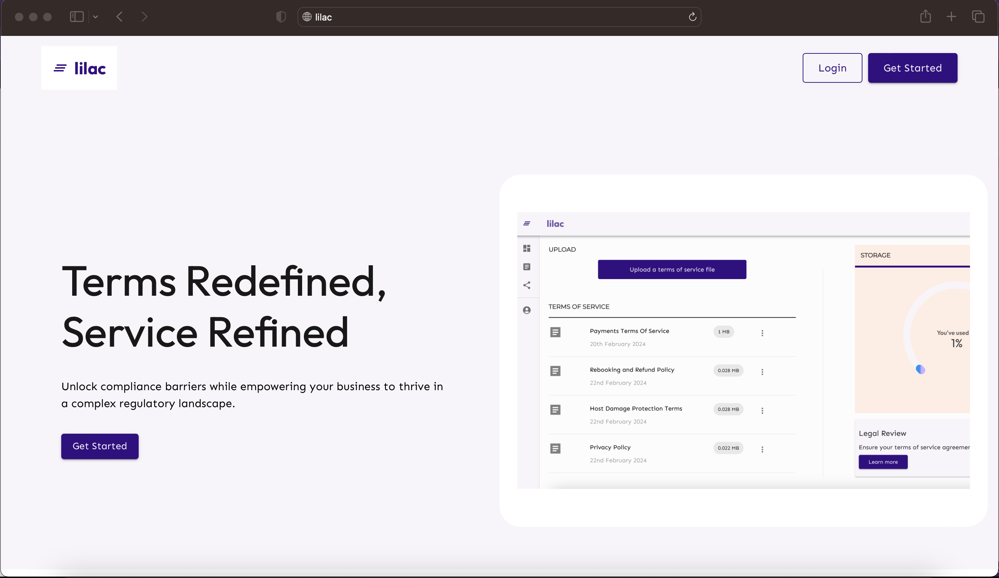
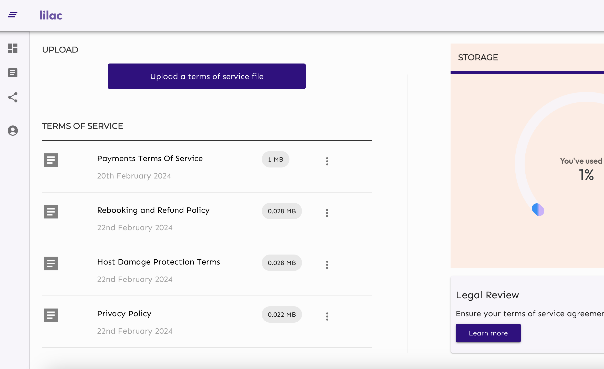

# Description

A web app that allows you to manage terms of service documents for your startup.

## Features

1. Creating, updating and deleting Terms of Service
2. Embedding created terms of service documents on client pages.
3. Version control for terms of service documents.
4. Legal consultation (coming soon)

## Technologies

Built using Python/Django and Typescript/React

